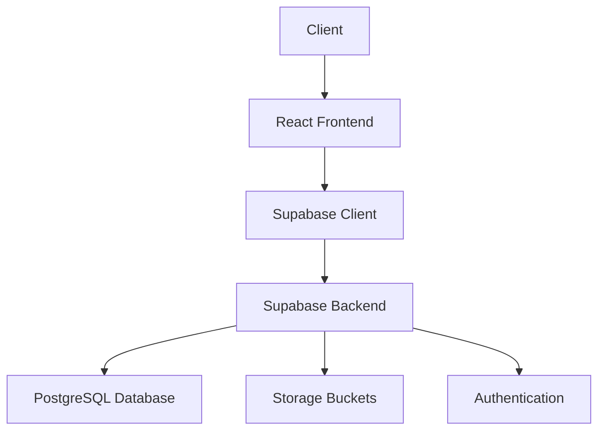

# LessonPortal API Documentation

This documentation provides comprehensive information about the LessonPortal API, including endpoints, authentication, testing, and deployment instructions.

## Table of Contents

1. [Architecture Overview](#architecture-overview)
2. [API Reference](#api-reference)
3. [Authentication](#authentication)
4. [Testing](#testing)
5. [Deployment](#deployment)
6. [Troubleshooting](#troubleshooting)

## Architecture Overview

LessonPortal is built using the following technologies:

- Frontend: React + Vite
- Backend: Supabase (PostgreSQL + Auth)
- Storage: Supabase Storage
- Authentication: Supabase Auth
- UI: shadcn/ui + Tailwind CSS

### System Architecture

### Data Flow

1. Client makes request through React components
2. Supabase client handles API calls
3. Supabase backend processes requests
4. Row Level Security (RLS) policies enforce access control
5. Data is returned to client

## API Reference

### Authentication Endpoints

#### Sign In
\`\`\`http
POST /auth/v1/token?grant_type=password

Content-Type: application/json

{
  "email": "user@example.com",
  "password": "password123"
}
\`\`\`

Response:
\`\`\`json
{
  "access_token": "eyJ...",
  "token_type": "bearer",
  "expires_in": 3600,
  "refresh_token": "ey..."
}
\`\`\`

#### Sign Out
\`\`\`http
POST /auth/v1/logout

Authorization: Bearer <access_token>
\`\`\`

### Profile Management

#### Get Profile
\`\`\`http
GET /rest/v1/profiles?id=eq.<user_id>

Authorization: Bearer <access_token>
\`\`\`

Response:
\`\`\`json
{
  "id": "uuid",
  "full_name": "John Doe",
  "avatar_url": "https://...",
  "role": "member",
  "created_at": "2025-02-14T..."
}
\`\`\`

#### Update Profile
\`\`\`http
PATCH /rest/v1/profiles?id=eq.<user_id>

Authorization: Bearer <access_token>
Content-Type: application/json

{
  "full_name": "John Doe",
  "avatar_url": "https://..."
}
\`\`\`

### Content Management

#### List Modules
\`\`\`http
GET /rest/v1/modules?select=*

Authorization: Bearer <access_token>
\`\`\`

Response:
\`\`\`json
[
  {
    "id": 1,
    "title": "Module Title",
    "description": "Description",
    "category_id": 1,
    "order_index": 1,
    "cover_url": "https://...",
    "status": "published"
  }
]
\`\`\`

#### Get Lessons
\`\`\`http
GET /rest/v1/lessons?module_id=eq.<module_id>&order=order_index

Authorization: Bearer <access_token>
\`\`\`

Response:
\`\`\`json
[
  {
    "id": "uuid",
    "title": "Lesson Title",
    "description": "Description",
    "module_id": 1,
    "youtube_url": "https://...",
    "order_index": 1
  }
]
\`\`\`

## Authentication

LessonPortal uses Supabase Authentication with the following features:

- Email/Password authentication
- JWT tokens for API requests
- Row Level Security (RLS) policies
- Role-based access control (member, admin, support)

### Security Measures

1. All API requests require authentication
2. RLS policies restrict data access
3. Passwords are hashed using bcrypt
4. JWT tokens expire after 1 hour
5. Refresh tokens for session management

## Testing

### Unit Tests

Location: \`/tests/unit\`

Run unit tests:
\`\`\`bash
npm run test:unit
\`\`\`

Coverage requirements:
- Statements: 80%
- Branches: 80%
- Functions: 80%
- Lines: 80%

### Integration Tests

Location: \`/tests/integration\`

Run integration tests:
\`\`\`bash
npm run test:integration
\`\`\`

### E2E Tests

Location: \`/tests/e2e\`

Run E2E tests:
\`\`\`bash
npm run test:e2e
\`\`\`

### Performance Tests

Location: \`/tests/performance\`

Run performance tests:
\`\`\`bash
npm run test:performance
\`\`\`

Performance benchmarks:
- Page load: < 2s
- API response: < 200ms
- Time to interactive: < 3s

## Deployment

### Prerequisites

- Node.js 18+
- npm 9+
- Supabase project
- Environment variables configured

### Environment Variables

\`\`\`env
VITE_SUPABASE_URL=https://your-project.supabase.co
VITE_SUPABASE_ANON_KEY=your-anon-key
\`\`\`

### Deployment Steps

1. Build the application:
   \`\`\`bash
   npm run build
   \`\`\`

2. Deploy to hosting service:
   \`\`\`bash
   npm run deploy
   \`\`\`

3. Run database migrations:
   \`\`\`bash
   supabase db push
   \`\`\`

### Monitoring

- Application metrics: Supabase Dashboard
- Error tracking: Console logs
- Performance monitoring: Browser DevTools

## Troubleshooting

### Common Issues

1. Authentication Errors
   - Check JWT token expiration
   - Verify correct environment variables
   - Ensure user has correct permissions

2. Database Errors
   - Check RLS policies
   - Verify database connections
   - Review migration status

3. Performance Issues
   - Check network requests
   - Review database indexes
   - Monitor API response times

### Support

For technical support:
1. Check documentation
2. Review error logs
3. Contact support team